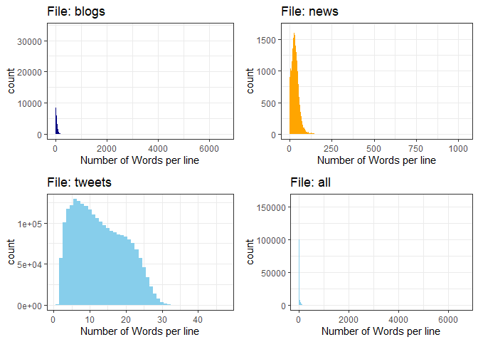
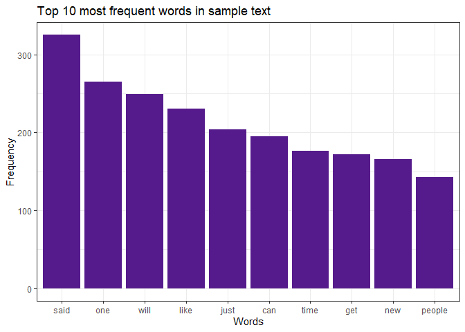
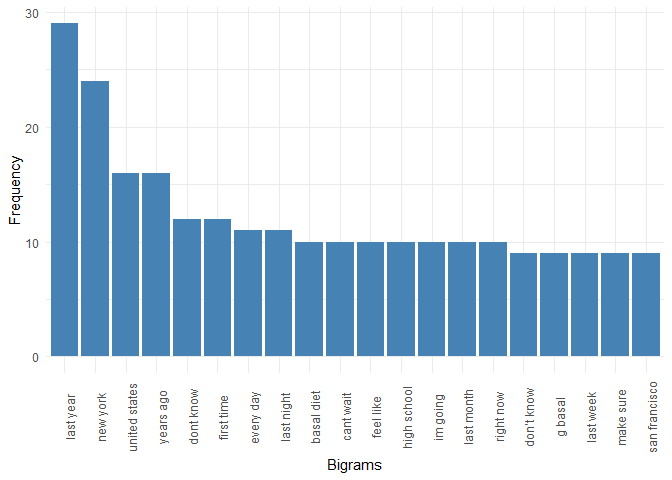
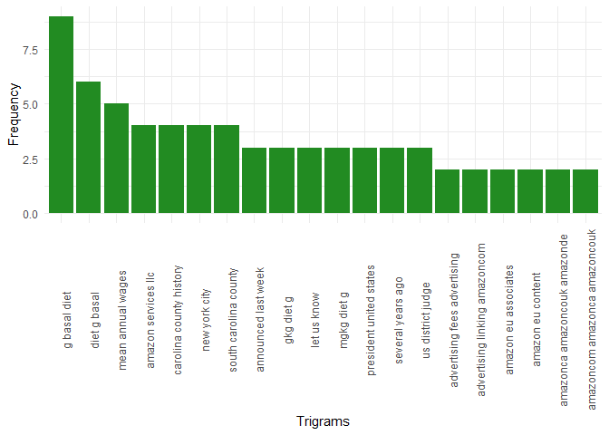

## Background information

This project is for the *Data Science Capstone Project* of Coursera's Data Science Specialization course by John Hopkins University and Swift Key.This milestone project is to summarize about the training data and explore ways to build a model to predict the upcoming text of a word input.


## Data source and Methods

The data is obtained from the following [link](https://d396qusza40orc.cloudfront.net/dsscapstone/dataset/Coursera-SwiftKey.zip) provided by Swift Key. It contains text data from various blogs, news and Twitter tweets. R programming language is used to process the data and perform exploratory data analysis.

### Get space to load and process the data

First of all, all objects in the environment of R are removed and unused memories are cleaned. Then, to save the memory and by pass the slow Internet connection, the data is pre-downloaded.


Then, the data is read into the environment.


### Required R packages

The following R packages are loaded:

1.  dplyr

2.  tidyr

3.  ggplot2

4.  tm

5.  tidytext

6.  knitr


## Summary of the training dataset

File size, number of lines, number of characters and number of words are counted as shown in **Table 1**.


#### Table1. Summary of the training data


|File   |   Lines| Characters|    Words|     Size|
|:------|-------:|----------:|--------:|--------:|
|blogs  |  899288|  206824509| 37334131| 255.4 Mb|
|news   |   77259|   15639408|  2643969|  19.8 Mb|
|tweets | 2360148|  206824509| 30373543|   319 Mb|

Distribution of number of words per line are described using histograms **(Figure 1)**.


<!-- -->

**Figure1. Histograms showing distribution of words per line**


The spread and average of words per line are summarized in **Table 2**.

#### Table2. Spread and average of words per line


|File   | Mean| SD| Median| IQR|  Max| Min|
|:------|----:|--:|------:|---:|----:|---:|
|blogs  |   42| 46|     28|  50| 6630|   1|
|news   |   34| 23|     31|  26| 1031|   1|
|tweets |   13|  7|     12|  11|   47|   1|

## Exploratory Data Analysis and Ngrams


To cover the memory of my computer, 1000 lines from each dataset are sampled as the training data. Then, the data is cleaned by converting to lower case and removing numbers, punctuations, stop-words and extra spaces.


Then, the cleaned text is converted into a table of words and their respective frequency.


The top ten most frequent words are shown in the frequency histogram (**Figure 2**).

<!-- -->

**Figure2. Words with most occurrence in the training data**


Then, ngrams (set of words occurring together) are created and the frequencies are counted as shown in **Figure 3** and **Figure 4**.

<!-- -->

**Figure3. Top 20 bi-grams (two words occurring together)**

<!-- -->

**Figure4. Top 20 tri-grams (three words occurring together)**

## Conclusion

A text prediction model will be built by using the frequency of occurrence of bi-grams and tri-grams.

## Appendix: Codes used for this report

### Get more memory

```         
rm(list = ls()) #-- remove object in environment gc(full = TRUE) #-- clean memory gc(reset = TRUE)
```

### Download data if necessary

```         
fileUrl <- "https://d396qusza40orc.cloudfront.net/dsscapstone/dataset/Coursera-SwiftKey.zip"

if(!file.exists("data")) { dir.create("data") }

if(!file.exists("data/final/en_US")) { tempFile \<- tempfile() download.file(fileUrl, tempFile) unzip(tempFile, exdir = "data") }
```

### Read data

```         

con <- file("data/final/en_US/en_US.blogs.txt", open = "r") 
blogs <- readLines(con) 
close(con)


con <- file("data/final/en_US/en_US.news.txt", open = "r") 
news <- readLines(con) 
close(con)


con <- file("data/final/en_US/en_US.twitter.txt", open = "r") 
tweets <- readLines(con) 
close(con)
```

### Libraries

```
library(dplyr) 
library(tidyr) 
library(ggplot2) 
library(tm) 
library(knitr) 
library(tidytext)
```

### Summarize data

#### File size
```
Size <- c(blogs = format(object.size(blogs), units = "Mb"), news = format(object.size(news), units = "Mb"), tweets = format(object.size(tweets), units = "Mb")) 
gc()
```
#### Number of lines

``` 
Lines <- c(blogs = length(blogs), news = length(news), tweets = length(tweets)) 
gc()
```
### Number of characters
```
Characters <- c(blogs = sum(sapply(blogs, nchar)), news = sum(sapply(news, nchar)), tweets = sum(sapply(blogs, nchar))) 
gc()
```  

### Numbers of words

```
wordCount <- function(x) {
  length(unlist(strsplit(x, split = " ")))
} 
Words <- c(blogs = wordCount(blogs), news = wordCount(news), tweets = wordCount(tweets))

desdf <- data.frame(Lines, Characters,Words,Size)
```  

### Summary table
```
desdf %>% kable(align = c("r","r","r","r"))
```  

### Word per line
```
wordPerLine <- function(x) { sapply(strsplit(x, split = " "), length) }

blogs_wpl <- wordPerLine(blogs) 
news_wpl <- wordPerLine(news) 
tweets_wpl <- wordPerLine(tweets)

blogHist <- ggplot(data = data.frame(wpl=blogs_wpl), aes(wpl))+ geom_histogram(fill = "navy", binwidth = 1)+ labs(x = "Number of Words per line", title = "File: blogs")+ theme_bw()

newsHist <- ggplot(data = data.frame(wpl=news_wpl), aes(wpl))+ geom_histogram(fill="orange", binwidth = 1)+ labs(x = "Number of Words per line", title = "File: news")+ theme_bw()

tweetsHist <- ggplot(data = data.frame(wpl=tweets_wpl), aes(wpl))+ geom_histogram(fill="skyblue", binwidth = 1)+ labs(x = "Number of Words per line", title = "File: tweets")+ theme_bw()

allHist <- ggplot(data = data.frame(wpl=c(blogs_wpl,news_wpl,tweets_wpl)), aes(wpl))+ geom_histogram(fill="skyblue", binwidth = 1)+ labs(x = "Number of Words per line", title = "File: all")+ theme_bw()
```  

### Plots in one grid
```
cowplot::plot_grid(blogHist, newsHist, tweetsHist, allHist)
```  

### Word per line table setup

``` 
max <- max(length(blogs_wpl),length(news_wpl), length(tweets_wpl)) 
length(blogs_wpl) <- max 
length(news_wpl) <- max 
length(tweets_wpl) <- max

words_per_line <- data.frame(blogs = blogs_wpl, news = news_wpl, tweets = tweets_wpl) rm("max") 
gc()
```  

### Word per line table----
```
words_per_line %>% summarise(across(everything(), list(Mean = mean, SD = sd, Median = median, IQR = IQR, Max = max, Min = min), na.rm = T)) %>% mutate(across(c(ends_with("Mean"), ends_with("SD")), round)) %>% pivot_longer( cols = everything(), names_to = c("File", "statistic"), names_sep = "_", values_to = "value") %>% pivot_wider(names_from = statistic, values_from = value)
```  

### Exploratory analysis

#### Sample data
```
set.seed(1000) 
blogsSample \<- sample(blogs, size = 1000) 
newsSample \<- sample(news, size = 1000) 
tweetsSample \<- sample(tweets, size = 1000) 
dataSample \<- c(blogsSample, newsSample, tweetsSample) txt \<- dataSample
```  

#### Clean data
```
txt \<- VectorSource(txt) ##--create vector source for Copora 
txt \<- Corpus(txt) ##-- create Copora 
txt \<- tm_map(txt, content_transformer(tolower)) #- to lower case 
txt \<- tm_map(txt, removeNumbers) #- remove the numbers in text 
txt \<- tm_map(txt, removePunctuation) #- remove the punctuation 
txt \<- tm_map(txt, removeWords, stopwords("english")) #- remove stopword 
txt \<- tm_map(txt, stripWhitespace) #- remove white space
```  

#### Document term matrix
```
doc.matrix \<- TermDocumentMatrix(txt) #- term document matrix created 
m \<- as.matrix(doc.matrix) #- convert to matirx 
v \<- sort(rowSums(m),decreasing = T) #- convert to vector of word and their frequency 
df \<- data.frame(word = names(v), freq = v)
``` 
#### word occurrence
```

df %\>% arrange(desc(freq)) %\>% slice_head(n = 10) %\>% ggplot(aes(reorder(word,-freq), freq))+ geom_col(fill = "purple4")+ labs(x ="Words", y = "Frequency", title = "Top 10 most frequent words in sample text")+ theme_bw()
```  

### N-grams
```
bigram \<- data.frame(txt = as.character(txt)) %\>% unnest_tokens(output = bigram, input = txt, token = "ngrams", n=2) trigram \<- data.frame(txt = as.character(txt)) %\>% unnest_tokens(output = trigram, input = txt, token = "ngrams", n=3)
```  

#### Bigram  
```
bigram %\>% count(bigram, sort = T) %\>% slice_head(n = 20) %\>% ggplot(aes(reorder(bigram,-n),n))+ geom_col(fill = "steelblue")+ labs(x = "Bigrams", y = "Frequency")+ theme_minimal()+ theme(axis.text.x = element_text(angle = 90))
```  

#### Trigram
```
trigram %\>% count(trigram, sort = T) %\>% slice_head(n = 20) %\>% ggplot(aes(reorder(trigram,-n),n))+ geom_col(fill = "forestgreen")+ labs(x = "Trigrams", y = "Frequency")+ theme_minimal()+ theme(axis.text.x = element_text(angle = 90)) \`\`\`
```  
